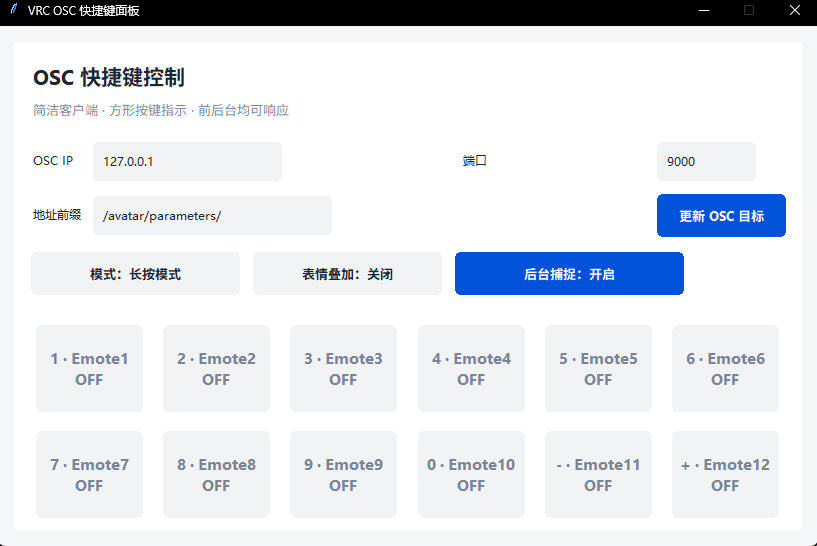

# VRC OSC 快捷键面板｜使用说明

轻量的桌面客户端，用数字键和符号键直接切换 VRChat Avatar 参数（Emote1-12），支持后台全局捕捉和状态可视化。




## 环境要求

- Windows 10/11。
- Python 3.9+。
- 依赖：`python-osc`（发送 OSC）。

## 安装与运行

1. 克隆或下载本仓库。

1. 安装依赖：

```bash
pip install python-osc
```

1. 直接运行：

```bash
python main.py
```

## 界面与操作

- OSC 目标：在顶部填写 IP / 端口 / 地址前缀（默认 `127.0.0.1:9000`，`/avatar/parameters/`），点击“更新 OSC 目标”生效。
- 按键映射：`1-9, 0, -, +` 分别对应 `Emote1-Emote12`，卡片会显示 ON/OFF。
- 模式切换：
  - 长按模式：按下发送 True，松开发送 False。
  - 切换模式：单击按键切换开关。
- 表情叠加：开启时允许多键同时开启；关闭时按下新键会关闭其它已开启键。
- 后台捕捉：开启后即使窗口未聚焦也能响应数字键/符号键。

## 常见用法示例

- 只想前台响应：关闭“后台捕捉”。
- 防止多键叠加：关闭“表情叠加”，保持一次只开一个表情。
- 快速切换：在“切换模式”下单击数字键即可开关。

## 打包可执行文件（可选）

已附示例打包配置，可用 PyInstaller 构建：

```bash
pyinstaller VRCBoolHotkeys.spec
# 或简化：
pyinstaller -F -w -n VRCBoolHotkeys main.py
```

生成产物默认在 `dist/`。

## 提示

- OSC 地址格式：`/avatar/parameters/<参数名>`，例如 `/avatar/parameters/Emote1`。
- 关闭“后台捕捉”后需要窗口聚焦才响应。
- 从“切换模式”回到“长按模式”时会同步物理按键，避免卡住在开启状态。
